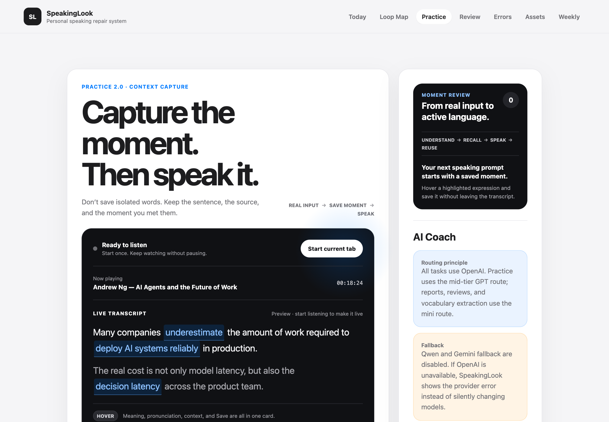
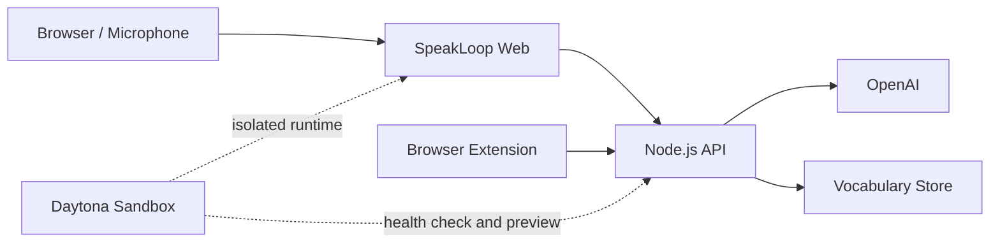

# SpeakLoop

> Turn every conversation into measurable speaking progress.

SpeakLoop is an AI-powered speaking improvement system for intermediate and advanced English learners. It connects mistakes, corrections, stronger phrasing, and next-day review from real conversations into a continuous loop, turning one-off speaking practice into a reusable personal language asset.



## 1. Evaluate It in 3 Minutes

1. Open the live demo: <https://4173-ffad62e5-caff-4782-958e-91b487321151.proxy.daytona.works>
   (It runs in a Daytona sandbox. On your first visit, Daytona displays a preview warning page; click "I Understand, Continue" to proceed.)
2. Go to `Practice` and answer a real question by typing or using your microphone.
3. Review the AI-generated natural correction, shorter spoken version, and follow-up question.
4. Repeat the corrected expression and save useful words or phrases to your personal asset library.
5. Open `Weekly` and click `Generate AI review`.
6. Review the generated practice plan for the next day.
7. On any webpage, double-click a word or hover over video subtitles to save it with its original sentence to `Assets`.
8. Review this repository's Daytona configuration and reproducible tests.

### 3-Minute Demo Video

[Watch or download the SpeakLoop demo](demo/SpeakingLoop-3min-demo.mp4) · [English subtitles](demo/SpeakingLoop-3min-demo.en.srt)

## 2. Product Value

Traditional speaking apps often stop when the conversation ends. SpeakLoop turns learning into a continuous cycle:

```text
Real-world input → Speak → Identify issues → Correct and repeat → Save expressions → Review the next day → Reuse
```

Its core benefits include:

- **Immediate correction:** Focuses only on the issues that most affect naturalness and comprehension.
- **Speakable phrasing:** Provides both a natural version and a shorter version that is easier to repeat.
- **Personal assets:** Saves vocabulary, original context, pronunciation, and usage history instead of isolated words.
- **Compounding progress:** Uses AI to generate the next practice task from each session, helping new expressions become part of the learner's active vocabulary.

## 3. Architecture



### How Daytona Is Used

- Creates an isolated, reproducible product environment from the same repository.
- Starts the complete web product from the Dockerfile.
- Verifies runtime status with health checks.
- Generates a temporary preview URL accessible to reviewers.
- Automatically stops and archives the sandbox after the demo to control resource costs.

### Model Strategy

The application selects a provider based on available credentials and uses only one provider at a time:

| Scenario | Provider |
| --- | --- |
| `OPENAI_API_KEY` is configured and has available quota | OpenAI (quality first) |
| OpenAI quota is exhausted, or only `GEMINI_API_KEY` is configured | Gemini (free tier, no credit card required) |
| Neither key is configured | Return an explicit error; never simulate a response |

- Live coaching, corrections, and follow-up questions use the strong model route. Next-day reviews, weekly reports, and vocabulary cards use the lower-cost mini route. Both providers follow this split.
- Speech recognition and text-to-speech are available **only through OpenAI**. If only Gemini is configured, microphone input and audio playback are unavailable, and the interface explains why.
- If OpenAI returns `insufficient_quota`, the application automatically switches to Gemini and labels the response as a `fallback`. **No other error triggers a provider switch**; the actual error is displayed instead, because treating a network failure as a fallback would hide the underlying problem.
- After a provider reports exhausted quota, the current process skips it for subsequent requests to avoid another failed round trip.

Get a free Gemini API key at <https://aistudio.google.com/apikey>. The free tier supports up to 1,500 requests per day.

> An earlier version routed batch tasks to Qwen on a Nosana GPU. That route has been removed from the code.
> `nosana/ollama.json` remains only as a historical deployment manifest and is not used by the current build.

## 4. Run Locally

Node.js 20 or later is required.

```bash
cp .env.example .env
# Add OPENAI_API_KEY to .env.
npm start
```

Open:

```text
http://127.0.0.1:4173
```

Verify:

```bash
npm test
npm run smoke
curl http://127.0.0.1:4173/api/health
```

Without an OpenAI API key, the interface, health checks, vocabulary capture, and review data flow still work. Live transcription, text-to-speech, and AI coaching require a valid OpenAI API key.

## 5. Run with Docker

```bash
docker build -t speakloop .
docker run --rm -p 4173:4173 --env-file .env speakloop
```

The container listens on `0.0.0.0:4173` and exposes health status at `/api/health`. To support temporary sandboxes, runtime vocabulary data is written to `/tmp/speakloop` by default. A production multi-user deployment should replace this with an external database.

## 6. Deploy to Daytona

See [DEPLOYMENT.md](DEPLOYMENT.md) for the complete procedure. The shortest path is:

```bash
daytona create \
  --name speakloop-demo \
  --target us \
  --dockerfile Dockerfile \
  --context . \
  --cpu 2 \
  --memory 4096 \
  --disk 10 \
  --auto-stop 60 \
  --auto-archive 60 \
  --public

daytona preview-url speakloop-demo --port 4173 --expires 21600
```

API keys must be configured only through Daytona Secrets or environment variables. Never commit them to the repository, include them in the Dockerfile, or expose them in screenshots.

This project has been deployed and validated in a browser in Daytona's `us` Container region. In Daytona CLI `v0.207+`, `--memory` is specified in MB; some older CLI versions use GB. Check the local output of `daytona create --help` before running the command.

## 7. Nosana Deployment (Legacy; Not Used by the Current Build)

> The following steps apply to an earlier version. The current code no longer includes the Qwen/Ollama route, so following them will not change the application's behavior.

The GPU job definition is located at [nosana/ollama.json](nosana/ollama.json). In the Nosana Dashboard, select a GPU Market with an available node, then run:

```bash
npm install -g @nosana/cli
nosana job post \
  --file nosana/ollama.json \
  --market <AVAILABLE_MARKET> \
  --timeout 60
```

Add the Ollama service URL returned by the job to Daytona Secrets:

```env
ENABLE_QWEN=true
DEFAULT_REPORT_PROVIDER=qwen
DEFAULT_REVIEW_PROVIDER=qwen
DEFAULT_VOCAB_PROVIDER=qwen
OLLAMA_BASE_URL=https://<nosana-service-url>
QWEN_TEXT_MODEL_STANDARD=qwen3:8b
QWEN_TEXT_MODEL_CHEAP=qwen3:8b
```

GPU Market IDs change with node availability, so the repository does not hard-code one. After starting the job, test it first:

```bash
curl "$OLLAMA_BASE_URL/api/tags"
```

## 8. API

| Endpoint | Method | Purpose |
|---|---:|---|
| `/api/health` | GET | Sandbox and container health check |
| `/api/ai/chat` | POST | Live speaking coach and corrections |
| `/api/transcribe` | POST | English speech transcription |
| `/api/tts` | POST | Audio for corrected sentences and follow-up questions |
| `/api/review/generate` | POST | Next-day review plan |
| `/api/capture` | POST | Save vocabulary or expressions |
| `/api/vocabulary` | GET | Retrieve personal expression assets |
| `/api/review/vocabulary` | GET | Retrieve due review tasks |

## 9. Environment Variables

| Variable | Default | Description |
|---|---|---|
| `HOST` | `0.0.0.0` | Server host address |
| `PORT` | `4173` | Server port |
| `OPENAI_API_KEY` | Empty | OpenAI API key |
| `OPENAI_TEXT_MODEL_MID` | `gpt-5.5` | Model for live coaching and corrections |
| `GEMINI_API_KEY` | Empty | API key for the free-tier fallback provider |
| `OPENAI_TEXT_MODEL_MINI` | `gpt-5.4-mini` | Model for reviews, weekly reports, and vocabulary cards |
| `VOCABULARY_STORE_PATH` | `data/vocabulary-store.json` | Data file for the single-user MVP |

See [.env.example](.env.example) for additional model variables.

## 10. Current Limitations

- `Context Capture` in the web app uses sample subtitles to demonstrate the complete hover, save, and review flow. Capturing audio from the current browser tab still requires the browser extension bridge.
- The JSON vocabulary store is suitable for a single-session demo, not a production multi-user environment.
- Microphone features require HTTPS or localhost and user permission.

## 11. Repository Map

```text
.
├── src/                     # Web UI
├── lib/                     # OpenAI calls, review, and vocabulary logic
├── apps/browser-extension/  # Caption and global expression capture
├── nosana/ollama.json       # Legacy GPU workload, not used by the current build
├── scripts/smoke-test.mjs   # End-to-end service smoke test
├── test/                    # Model path tests
├── server.mjs               # Node.js API and static server
├── Dockerfile               # Daytona/container entry point
└── DEPLOYMENT.md            # Deployment runbook
```

## 12. License

[MIT](LICENSE)
