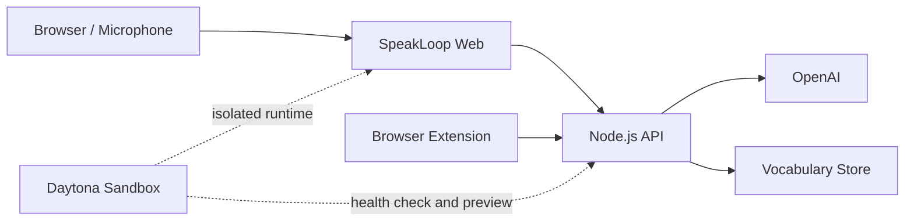

# SpeakLoop

> Turn every conversation into measurable speaking progress.

SpeakLoop 是面向中高级英语学习者的 AI 口语修复系统。它把真实对话中的错误、纠正、优质表达和次日复习连接成一个闭环，让一次性的口语练习沉淀为可以持续复用的个人语言资产。


## 1. Judge in 3 Minutes

1. 打开在线演示地址（发布后补充）。
2. 进入 `Practice`，用文字或麦克风回答一个真实问题。
3. 查看 AI 给出的自然纠正、简短口语版本和追问。
4. 重复正确表达，将词汇或短语保存到个人资产库。
5. 打开 `Weekly`，点击 `Generate AI review`。
6. 查看生成的次日练习计划。
7. 在任意网页上双击一个单词，或悬停视频字幕，把它连同原句存进 `Assets`。
8. 查看本仓库的 Daytona 配置和可复现测试。

## 2. 产品价值

传统口语应用往往止步于“聊完一次”。SpeakLoop 把学习过程设计成连续循环：

```text
真实输入 → 开口表达 → 发现问题 → 修复并复述 → 保存表达 → 次日复习 → 再次使用
```

核心价值包括：

- 即时修复：只纠正最影响自然度和理解的关键问题。
- 可说表达：同时提供自然版本和更短、更容易复述的版本。
- 个人资产：保存词汇、原始语境、发音和使用记录，而不是收藏孤立单词。
- 学习复利：AI 根据本次会话生成下一次练习任务，推动表达真正进入主动词汇。

## 3. 技术架构



### Daytona 的作用

- 从同一份仓库创建隔离、可复现的产品环境。
- 通过 Dockerfile 启动完整 Web 产品。
- 使用健康检查验证运行状态。
- 生成评委可访问的临时预览地址。
- 演示结束后自动停止和归档，控制资源成本。

### 模型策略

当前构建只使用 OpenAI，没有第二个 provider，也没有静默降级：

- 实时口语教练、纠错、追问走 `OPENAI_TEXT_MODEL_MID`。
- 次日复习、周报、词汇卡片走更便宜的 `OPENAI_TEXT_MODEL_MINI`。
- 语音识别用 `gpt-4o-transcribe`，朗读用 `gpt-4o-mini-tts`（带本地缓存）。

如果 key 缺失或 OpenAI 不可达，界面会显示真实错误，而不是用一个更弱的模型伪装成正常回答。

> 早期版本把批处理任务路由到 Nosana GPU 上的 Qwen。该路由已从代码中移除，
> `nosana/ollama.json` 仅作为历史部署清单保留，当前构建不会调用它。

## 4. 本地运行

需要 Node.js 20 或更高版本。

```bash
cp .env.example .env
# 在 .env 中填写 OPENAI_API_KEY。
npm start
```

打开：

```text
http://127.0.0.1:4173
```

验证：

```bash
npm test
npm run smoke
curl http://127.0.0.1:4173/api/health
```

即使没有 OpenAI Key，页面、健康检查、词汇捕获和复习数据流程仍可运行；实时转录、语音合成和 AI 教练需要有效的 OpenAI Key。

## 5. Docker 运行

```bash
docker build -t speakloop .
docker run --rm -p 4173:4173 --env-file .env speakloop
```

容器监听 `0.0.0.0:4173`，并通过 `/api/health` 提供健康状态。为了适应临时沙箱，默认把运行时词汇数据写入 `/tmp/speakloop`；正式多用户产品应替换为外部数据库。

## 6. Daytona 部署

完整操作见 [DEPLOYMENT.md](DEPLOYMENT.md)。最短路径：

```bash
daytona create \
  --name speakloop-demo \
  --target us \
  --dockerfile Dockerfile \
  --context . \
  --cpu 2 \
  --memory 4096 \
  --disk 10 \
  --auto-stop 60 \
  --auto-archive 60 \
  --public

daytona preview-url speakloop-demo --port 4173 --expires 21600
```

API Key 只能配置在 Daytona 的 Secret/环境变量中，不得写入仓库、Dockerfile 或截图。

本次已在 `us` Container 区域完成真实部署和浏览器验收。Daytona CLI `v0.207+` 的 `--memory` 单位为 MB；部分旧版 CLI 使用 GB，执行前请以 `daytona create --help` 的本机输出为准。

## 7. Nosana 部署（历史，当前构建未接入）

> 下面的步骤来自早期版本。当前代码已移除 Qwen/Ollama 路由，照做不会改变应用行为。

GPU Job 定义位于 [nosana/ollama.json](nosana/ollama.json)。在 Nosana Dashboard 中选择当前有可用节点的 GPU Market，然后执行：

```bash
npm install -g @nosana/cli
nosana job post \
  --file nosana/ollama.json \
  --market <AVAILABLE_MARKET> \
  --timeout 60
```

把任务返回的 Ollama 服务地址写入 Daytona Secret：

```env
ENABLE_QWEN=true
DEFAULT_REPORT_PROVIDER=qwen
DEFAULT_REVIEW_PROVIDER=qwen
DEFAULT_VOCAB_PROVIDER=qwen
OLLAMA_BASE_URL=https://<nosana-service-url>
QWEN_TEXT_MODEL_STANDARD=qwen3:8b
QWEN_TEXT_MODEL_CHEAP=qwen3:8b
```

GPU Market ID 会随可用节点变化，因此仓库不写死 Market。启动任务后应先测试：

```bash
curl "$OLLAMA_BASE_URL/api/tags"
```

## 8. API

| Endpoint | Method | 用途 |
|---|---:|---|
| `/api/health` | GET | 沙箱和容器健康检查 |
| `/api/ai/chat` | POST | 实时口语教练与纠错 |
| `/api/transcribe` | POST | 英语语音转录 |
| `/api/tts` | POST | 纠正句与追问语音 |
| `/api/review/generate` | POST | 次日复习计划 |
| `/api/capture` | POST | 保存词汇或表达 |
| `/api/vocabulary` | GET | 获取个人表达资产 |
| `/api/review/vocabulary` | GET | 获取到期复习任务 |

## 9. 环境变量

| 变量 | 默认值 | 说明 |
|---|---|---|
| `HOST` | `0.0.0.0` | 服务监听地址 |
| `PORT` | `4173` | 服务端口 |
| `OPENAI_API_KEY` | 空 | OpenAI 服务密钥 |
| `OPENAI_TEXT_MODEL_MID` | `gpt-5.5` | 实时教练与纠错模型 |
| `OPENAI_TEXT_MODEL_MINI` | `gpt-5.4-mini` | 复习、周报、词汇卡片模型 |
| `VOCABULARY_STORE_PATH` | `data/vocabulary-store.json` | 单用户 MVP 数据文件 |

更多模型变量见 [.env.example](.env.example)。

## 10. 当前边界

- 网页中的 `Context Capture` 使用预置字幕演示完整的悬停、保存和复习流程；当前标签页音频捕获仍需通过浏览器扩展桥接。
- JSON 词汇存储适合单场演示，不适合正式多用户生产环境。
- 麦克风功能需要 HTTPS 或 localhost，并需要用户授权。

## 11. Repository Map

```text
.
├── src/                     # Web UI
├── lib/                     # OpenAI calls, review and vocabulary logic
├── apps/browser-extension/  # Captions and global expression capture
├── nosana/ollama.json       # Legacy GPU workload, not used by the current build
├── scripts/smoke-test.mjs   # End-to-end service smoke test
├── test/                    # Model path tests
├── server.mjs               # Node.js API and static server
├── Dockerfile               # Daytona/container entry point
└── DEPLOYMENT.md            # Deployment runbook
```

## 12. License

[MIT](LICENSE)
